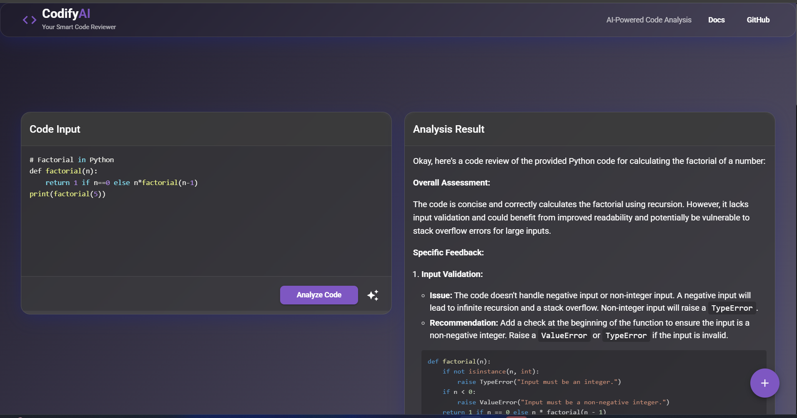

# 🚀 Codify – AI-Powered Code Reviewer

**Codify** is an intelligent, Gemini-powered code review application that helps developers write cleaner, more efficient code. With real-time analysis and AI-driven suggestions, it supports multiple languages, streamlines the code review process, and enhances developer productivity.

---

## ✨ Features

- ✅ **AI-Powered Code Review** using Google's Gemini AI  
- ✅ **Support for Multiple Programming Languages**  
- ✅ **Live Code Editing** with Monaco Editor  
- ✅ **Intelligent Refactoring Suggestions**  
- ✅ **Modern Dark-Themed UI**  
- ✅ **Copy-to-Clipboard** Functionality for Refactored Code  

---

## 🌐 Live Demo

👉 Try Codify Live: https://ai-powered-code-reviewer-sage.vercel.app

---

## 📁 Project Structure

```
Codify/
├── Backend/         # Node.js backend using Gemini AI
├── Frontend/        # React frontend with Monaco Editor
├── .env             # Add your Gemini API Key here
└── README.md
```

---

## ⚙️ Installation (Development Mode)

### Prerequisites

- Node.js 18+
- npm

### 1. Clone the Repository

```bash
git clone https://github.com/scriptbyayush/AI-Powered-Code-Reviewer.git
cd AI-Powered-Code-Reviewer
```

### 2. Set Your API Key

Create a `.env` file in the root directory and add:

```env
GOOGLE_GEMINI_KEY=your_api_key_here
```

> 🛡️ Don’t share your `.env` file publicly!

---

### 3. Start the Backend

```bash
cd Backend
npm install
npm run dev
```

---

### 4. Start the Frontend

```bash
cd ../Frontend
npm install
npm start
```

---

## 🧪 Sample Usage

1. Open the live app or run locally.
2. Paste your code into the editor.
3. Click **"Review Code"** to get AI suggestions.
4. Use **"Copy Refactored Code"** to copy improvements instantly.

---

## 📦 Tech Stack

- **Frontend:** React.js, Monaco Editor, Material UI  
- **Backend:** Node.js, Express  
- **AI Integration:** Gemini AI API  
- **Hosting:** Vercel  
- **Environment:** `.env` for API key management  

---

## 🖼️ Screenshots



> Screenshot of the Codify interface showing the Monaco Editor with AI-powered code suggestions.

---


## 🛡️ License

MIT License  
Feel free to use and modify. Please give credit if you fork or build upon this.

---

## 🙌 Acknowledgements

- [Google Gemini AI](https://deepmind.google/technologies/gemini/)  
- [Monaco Editor](https://microsoft.github.io/monaco-editor/)  
- [Vercel Hosting](https://vercel.com)

---

## 📬 Contact

**Developer:** [Ayush Vaidya](mailto:ayush.pict@gmail.com)  
**GitHub:** [scriptbyayush](https://github.com/scriptbyayush)
